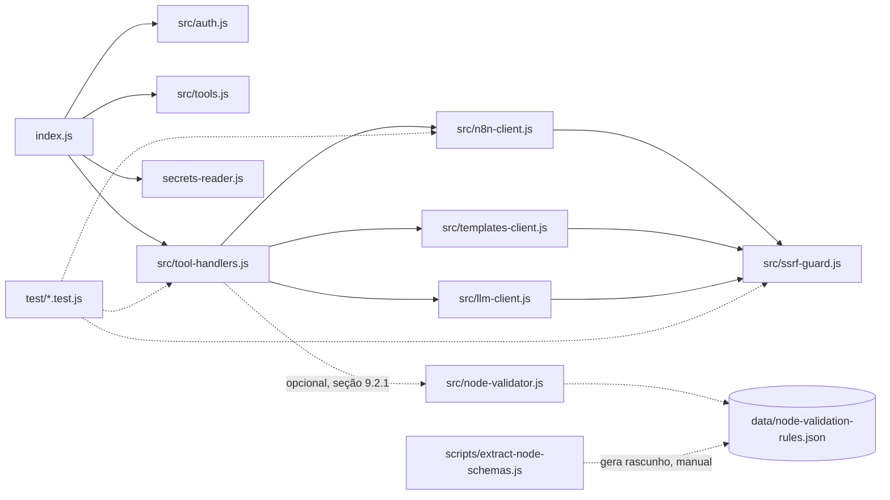

# SPEC: Tools MCP n8n — index.js / secrets-reader.js

> Status: proposta (não implementada). Esta SPEC documenta o que deve ser acrescentado, atualizado e otimizado nas tools MCP de interação com n8n do servidor leve atual (`index.js` + `secrets-reader.js`), incorporando os padrões e capacidades mais relevantes do projeto de referência `model-n8n-czlonkowski` (czlonkowski/n8n-mcp) — sem adotar sua stack pesada (TypeScript, SQLite de docs de nodes, geração via IA).

> 🙏 **Créditos**: o projeto de referência usado nesta análise é **[czlonkowski/n8n-mcp](https://github.com/czlonkowski/n8n-mcp)** (MIT, 22k+ estrelas), criado e mantido por **[@czlonkowski](https://github.com/czlonkowski)**. A pasta local `model-n8n-czlonkowski/` referenciada nos caminhos de arquivo abaixo é apenas uma cópia local desse repositório, usada exclusivamente como material de estudo/leitura para esta SPEC — nenhum código dele foi copiado para este projeto. Todos os caminhos `model-n8n-czlonkowski/src/...` citados nesta SPEC correspondem 1:1 a `src/...` no repositório original.

## 1. Objetivo

Evoluir o servidor MCP atual (`index.js` + `secrets-reader.js`) — hoje com 10 tools simples que fazem `fetch` direto para a API REST do n8n — incorporando os padrões mais valiosos do projeto modelo, porém **mantendo a filosofia atual**: JavaScript puro com ESM, sem build step, sem TypeScript, sem banco SQLite, autenticação multi-tenant via headers (`X-MCP-KEY`, `X-N8N-URL`, `X-N8N-API-KEY`).

Esta SPEC é o documento guia para uma implementação incremental (Fase 1 primeiro, Fase 2 depois). Os defaults de escopo abaixo foram assumidos pelo autor da SPEC (perguntas de esclarecimento foram puladas na sessão de criação) — ajuste conforme necessário antes de implementar.

## 2. Estado atual (baseline)

- `index.js`: Express + `node-fetch`, expõe `POST /mcp` (JSON-RPC 2.0) e `GET /mcp` (SSE keep-alive). `makeN8nRequest(n8nUrl, n8nApiKey)` (linhas 8-26) monta um client de fetch simples por requisição, sem paginação, sem retry, sem validação de URL.
- 10 tools atuais (`getToolDefinitions`, linhas 29-120, e `executeTool`, linhas 123-203): `list_workflows`, `search_workflows`, `get_workflow`, `create_workflow`, `update_workflow`, `activate_workflow`, `delete_workflow`, `get_executions`, `execute_workflow_via_webhook`, `get_workflow_as_template`.
- `get_workflow`/`list_workflows` sempre devolvem o JSON inteiro do n8n (`JSON.stringify(data, null, 2)`) — sem modos de detalhe, o que estoura contexto em workflows grandes.
- Autenticação em duas camadas: `X-MCP-KEY` validada contra `MCP_ALLOWED_KEYS` (multi-usuário), e credenciais do n8n vêm **sempre** dos headers `X-N8N-URL`/`X-N8N-API-KEY` por requisição (multi-tenant) — nunca há fallback para os secrets do servidor.
- `secrets-reader.js` carrega `N8N_URL_FILE`, `N8N_API_KEY_FILE` e `MCP_ALLOWED_KEYS_FILE` (Docker secrets) para `process.env`, mas **`N8N_URL`/`N8N_API_KEY` carregados nunca são usados** em `index.js` hoje — gap a corrigir (ver seção 7, item 5).
- `package.json` declara `@modelcontextprotocol/sdk` e `redis` como dependências, mas nenhuma é importada em `index.js` — sobra a remover ou justificar.

## 3. O que o projeto modelo oferece (mapeado)

Arquivos analisados em `model-n8n-czlonkowski`:

- `src/services/n8n-api-client.ts` — cliente axios completo: workflows, execuções, credenciais, tags, variáveis, data tables, source control, audit, webhook trigger com proteção SSRF, paginação por cursor, fallback PUT→PATCH, normalização de respostas legado (array vs `{data, nextCursor}`).
- `src/mcp/tools-n8n-manager.ts` — definições das tools `n8n_create_workflow`, `n8n_get_workflow` (com `mode`), `n8n_update_full_workflow`, `n8n_update_partial_workflow` (diff ops), `n8n_delete_workflow`, `n8n_list_workflows`, `n8n_validate_workflow`, `n8n_autofix_workflow`, `n8n_test_workflow`, `n8n_executions`, `n8n_health_check`, `n8n_workflow_versions`, `n8n_deploy_template`, `n8n_manage_datatable`, `n8n_manage_credentials`, `n8n_generate_workflow`, `n8n_audit_instance`.
- `src/types/workflow-diff.ts` — tipos de operação para update parcial (`addNode`, `removeNode`, `updateNode`, `patchNodeField`, `moveNode`, `enableNode`, `disableNode`, `addConnection`, `removeConnection`, `updateSettings`, `updateName`, `addTag`, `removeTag`, `activateWorkflow`, `deactivateWorkflow`, `transferWorkflow`).
- `src/utils/n8n-errors.ts` — classes de erro padronizadas por status HTTP (401/404/400/429/5xx) e mensagens amigáveis.
- `src/utils/ssrf-protection.ts` — bloqueio de localhost/IP privado/metadata de nuvem, com modos `strict`/`moderate`/`permissive`.

### Fora de escopo

Itens que exigem infraestrutura inexistente hoje e descaracterizariam o projeto leve:

- Banco SQLite de documentação de 500+ nodes (`search_nodes`, `get_node`, `validate_node`, `validate_workflow`, `autofix_workflow`) — dependem de `data/nodes.db`. Mitigação parcial (arquivo JSON estático curado, sem banco, ~35 node-types) **especificada em detalhe na seção 9.2.1** — pendente de implementação, mas pronta para isso.
- `n8n_workflow_versions` (histórico/rollback de versões) — **decisão deliberada de não implementar** (não é uma limitação técnica). O n8n já oferece nativamente um histórico de versões do workflow (Workflow History, na própria interface, a cada salvamento) — recurso da plataforma, independente do MCP. Reimplementar isso no servidor MCP duplicaria, com armazenamento local próprio, uma capacidade que o usuário já tem disponível direto no n8n. Ver justificativa completa na seção 9.2.

> Nota: `n8n_deploy_template`/`n8n_generate_workflow` do projeto modelo dependem de um banco local de templates e de geração com IA própria — **mas** confirmamos (`model-n8n-czlonkowski/src/templates/template-fetcher.ts:41`) que a API `https://api.n8n.io/api/templates` é pública e pode ser consultada **ao vivo, sem banco local**. Por isso, versões simplificadas de `search_templates`/`deploy_template` e uma tool de geração de workflow via IA **opt-in** (chave de LLM do próprio usuário) entraram no escopo da Fase 1 — ver seção 5.2.

## 4. Nova organização de arquivos (modular, sem build step)



- `index.js`: apenas Express + rotas (`/health`, `/mcp` GET/POST) + JSON-RPC dispatch (`initialize`, `tools/list`, `tools/call`, `ping`). Fica pequeno (~80 linhas).
- `src/auth.js`: middleware que extrai e valida `X-MCP-KEY` contra `MCP_ALLOWED_KEYS` (lógica hoje nas linhas 230-253 de `index.js`).
- `src/n8n-client.js`: substitui `makeN8nRequest`. Expõe um objeto com métodos por recurso (`workflows.list/get/create/update/delete/activate/deactivate`, `executions.list/get/delete`, `credentials.list/get/create/update/delete/getSchema`, `tags.list/create/update/delete/assignToWorkflow`, `variables.list/create/update/delete`, `dataTables.*` [Fase 2], `audit.generate`, `webhook.trigger`). Centraliza: paginação por cursor, normalização de resposta (array legado vs `{data, nextCursor}`), fallback PUT→PATCH, timeout configurável, erros padronizados.
- `src/ssrf-guard.js`: `assertSafeUrl(url, { mode })` — valida host antes de qualquer `fetch` (URL base do n8n e URL de webhook).
- `src/templates-client.js`: **novo** — wrapper fino para `https://api.n8n.io/api/templates` (`search`, `getById`), usando o `node-fetch` já presente em `package.json` (nenhuma dependência nova). Host fixo/hardcoded (não vem de input do usuário), então não passa pelo `ssrf-guard` (não há alvo controlável pelo cliente nesta chamada).
- `src/llm-client.js`: **novo** — wrapper fino para a chamada REST de geração de workflow via LLM (ex.: endpoint de chat completion da OpenAI ou compatível), também via `node-fetch` puro — **sem SDK de IA como dependência** (não introduz `openai`, `@anthropic-ai/sdk` etc. no `package.json`). Usa a chave informada pelo próprio usuário em runtime (nunca lida de `process.env`).
- `src/tools.js`: array de `inputSchema` das tools (separado do `index.js`, hoje embutido em `getToolDefinitions`).
- `src/tool-handlers.js`: `executeTool(name, args, n8nClient)` — dispatcher (substitui o `switch` hoje em `executeTool`).
- `secrets-reader.js`: mantido como está (raiz, import relativo já usado).
- `test/*.test.js`: **novo** — testes com `node:test` (ver seção 10).
- `.github/workflows/ci.yml`: **novo** — pipeline de CI (ver seção 10).
- `src/node-validator.js`: **novo, opcional** (mitigação 9.2 — ver seção 9.2.1) — valida `parameters` de nodes conhecidos contra `data/node-validation-rules.json`. Não tem dependência de runtime nova.
- `data/node-validation-rules.json`: **novo, opcional** — arquivo estático curado manualmente (poucos KB), não é banco de dados, só JSON versionado no Git.
- `scripts/extract-node-schemas.js`: **novo, opcional, devtool** — gera rascunho do JSON acima a partir do pacote `n8n-nodes-base` (instalado manualmente, nunca em produção). Ver seção 9.2.1.3.

## 5. Tools — Fase 1 (Core, todas via API REST nativa do n8n, sem dependências novas)

### 5.1 Otimizações em tools existentes (mantendo nomes — sem breaking change)

- **`get_workflow`**: adicionar `mode` opcional (`full` | `structure` | `minimal` | `filtered`) e `nodeNames` (para `filtered`). Hoje sempre devolve o JSON completo; `structure`/`minimal`/`filtered` evitam estourar o contexto em workflows grandes. Inspirado em `n8n_get_workflow` (`model-n8n-czlonkowski/src/mcp/tools-n8n-manager.ts:82-119`).
- **`list_workflows`**: adicionar `limit`, `cursor`, `active`, `tags` como parâmetros de query reais (hoje busca tudo e nunca pagina) e devolver `nextCursor`. Baseado em `n8n_list_workflows`.
- **`search_workflows`**: reusa a listagem paginada internamente; mantém filtro client-side por nome (instâncias normalmente têm poucas centenas de workflows).
- **`create_workflow`**: validar forma mínima de cada node (`id`, `name`, `type`, `typeVersion`, `position`, `parameters`) antes de enviar, com mensagem de erro clara em vez de erro genérico do n8n.
- **`update_workflow`**: manter GET+merge+PUT atual; adicionar fallback PUT→PATCH em `405` (compatibilidade com n8n mais antigo), como em `N8nApiClient.updateWorkflow` (`model-n8n-czlonkowski/src/services/n8n-api-client.ts:278-315`).
- **`get_executions`**: adicionar `cursor`, `status` (`success`/`error`/`waiting`) e `mode` (`preview` = só status/timestamps, `full` = atual) para controlar tamanho da resposta.
- **`execute_workflow_via_webhook`**: validar a URL com `ssrf-guard` antes do fetch; aceitar `httpMethod` (GET/POST/PUT/DELETE) e `headers` customizados, como em `n8n_test_workflow` / `triggerWebhook` (`model-n8n-czlonkowski/src/services/n8n-api-client.ts:451-509`).
- **`get_workflow_as_template`**: ao exportar, também remover `webhookId` dos nodes de webhook (hoje só remove `id`) para evitar colisão ao reimportar.

### 5.2 Tools novas

- **`delete_execution { id }`** — `DELETE /executions/{id}`. Fonte: `n8n_executions` (action=delete).
- **`health_check {}`** — tenta `/healthz`, fallback `GET /workflows?limit=1`; devolve `{ ok, n8nVersion?, latencyMs }`. Versão simplificada (sem modo `diagnostic` que despeja env vars — não cabe num server multi-tenant). Fonte: `n8n_health_check`.
- **`manage_credentials { action: list|get|create|update|delete|getSchema, id?, name?, type?, data? }`** — wraps `/credentials*`. **Nunca loga `data`** (redação obrigatória nos logs/erros). Fonte: `n8n_manage_credentials` (`model-n8n-czlonkowski/src/mcp/tools-n8n-manager.ts:667-689`).
- **`manage_tags { action: list|create|update|delete|assign, id?, name?, workflowId?, tagIds? }`** — wraps `/tags*` e `PUT /workflows/{id}/tags`.
- **`manage_variables { action: list|create|update|delete, id?, key?, value? }`** — wraps `/variables*`; trata 404 graciosamente (nem toda instância expõe essa API), igual a `getVariables` no client modelo.
- **`audit_instance { categories?, daysAbandonedWorkflow? }`** — passthrough formatado de `POST /audit` (API nativa do n8n). Fonte: `generateAudit` (`model-n8n-czlonkowski/src/services/n8n-api-client.ts:375-387`). O scan customizado de segredos hardcoded/webhooks sem auth do `n8n_audit_instance` completo fica como melhoria de Fase 2.
- **`update_workflow_partial { id, operations[] }`** — atualização incremental via diff ops, evitando reenviar `nodes`/`connections` inteiros. Subconjunto suportado: `addNode`, `removeNode`, `updateNode`, `patchNodeField` (`fieldPath` + `patches: [{find, replace}]`), `moveNode`, `enableNode`/`disableNode`, `addConnection`, `removeConnection`, `updateSettings`, `updateName`, `activateWorkflow`, `deactivateWorkflow`. Implementação: GET workflow → aplica operações em memória (motor simplificado, sem todas as validações do `workflow-diff-engine.ts` original) → PUT. **Item de maior complexidade/esforço da Fase 1** — fonte: `n8n_update_partial_workflow` + tipos em `model-n8n-czlonkowski/src/types/workflow-diff.ts`.

### 5.2.1 Tools mitigadas da seção 9.1 (aplicadas nesta versão da SPEC)

As quatro tools abaixo eram tratadas como "fora de escopo" na primeira versão desta SPEC. Foram reavaliadas (seção 9.1) e **entram na Fase 1** em versão simplificada, pois não exigem banco de dados nem credenciais compartilhadas no servidor.

- **`search_templates { search?, limit?, cursor? }`** — `GET https://api.n8n.io/api/templates/search?page=&rows=&search=`, live (sem cache/banco local). Devolve lista resumida `{ id, name, description, totalViews, nodes[] }`. Fonte: `model-n8n-czlonkowski/src/templates/template-fetcher.ts:41,112` (endpoint confirmado público, sem autenticação).
- **`get_template { templateId }`** — `GET https://api.n8n.io/api/templates/workflows/{templateId}`, live. Devolve `{ id, name, description, workflow: { nodes, connections, settings } }` para inspeção antes de decidir importar.
- **`deploy_template { templateId, name?, stripCredentials? }`** — busca o template (mesma chamada de `get_template`), remove `id`/`webhookId` dos nodes (igual ao `get_workflow_as_template`) e, se `stripCredentials` (default `true`), remove referências de `credentials` dos nodes; em seguida chama internamente `create_workflow`. **Sem auto-fix/auto-upgrade de `typeVersion`** (isso exigiria a base de nodes do modelo completo — fora de escopo) — o usuário recebe o workflow importado inativo e deve revisar/configurar credenciais manualmente. Fonte simplificada de `n8n_deploy_template`.
- **`generate_workflow_draft { description }`** — gera uma **proposta** de workflow (JSON `nodes`/`connections`) a partir de uma descrição em linguagem natural, chamando a API de um provedor LLM. **Opt-in e stateless**: exige os headers `X-LLM-API-KEY` (obrigatório) e `X-LLM-PROVIDER` (opcional, default `openai`) na requisição — igual ao padrão de `X-N8N-API-KEY`, a chave nunca é lida de `process.env` nem persistida. Devolve só o JSON proposto (texto), sem deploy automático; o usuário decide chamar `create_workflow` depois para efetivar. Sem cache de propostas (sem `deploy_id`/`confirm_deploy` como no modelo original) para manter o servidor stateless. Se o header `X-LLM-API-KEY` não vier, a tool retorna erro explicando que é opcional e como habilitá-la — nunca falha o `tools/list` geral.

### 5.3 Resumo das tools após Fase 1

| Tool | Status |
|---|---|
| `list_workflows` | otimizada (paginação/filtros) |
| `search_workflows` | otimizada (reusa paginação) |
| `get_workflow` | otimizada (`mode`/`nodeNames`) |
| `create_workflow` | otimizada (validação de shape) |
| `update_workflow` | otimizada (fallback PATCH) |
| `update_workflow_partial` | **nova** |
| `activate_workflow` | mantida |
| `delete_workflow` | mantida |
| `get_executions` | otimizada (paginação/`mode`) |
| `delete_execution` | **nova** |
| `execute_workflow_via_webhook` | otimizada (SSRF guard, método/headers) |
| `get_workflow_as_template` | otimizada (limpeza de `webhookId`) |
| `health_check` | **nova** |
| `manage_credentials` | **nova** |
| `manage_tags` | **nova** |
| `manage_variables` | **nova** |
| `audit_instance` | **nova** (passthrough simples) |
| `search_templates` | **nova** (mitigação 9.1, live, sem banco) |
| `get_template` | **nova** (mitigação 9.1, live, sem banco) |
| `deploy_template` | **nova** (mitigação 9.1, sem auto-fix/auto-upgrade) |
| `generate_workflow_draft` | **nova** (mitigação 9.1, opt-in via `X-LLM-API-KEY`) |

## 6. Tools — Fase 2 (documentadas, não implementadas agora)

- **`manage_datatable`** — CRUD de data tables + linhas (fonte: `n8n_manage_datatable`). Schema grande; vale ticket próprio.
- **`audit_instance` (deep scan)** — adicionar a varredura de segredos hardcoded/webhooks sem autenticação por regex no próprio código (sem precisar do DB de nodes).
- **Validação semântica de nodes completa** (`validate_node`/`autofix_workflow` com paridade total ao modelo, cobrindo os 500+ nodes) — continua fora de escopo, pois depende do pipeline completo de SQLite + docs. A versão **leve** (`validate_node_config`, ~35 node-types curados) **já está totalmente especificada** na seção 9.2.1 e pode ser implementada de forma independente das demais tools de Fase 2 (é só um módulo adicional, sem dependência das outras) — ver passo 12 do roadmap (seção 8).

> ❌ **`workflow_versions` (histórico/rollback) não está em nenhuma fase desta SPEC** — decisão deliberada de não implementar, não um item adiado. Ver justificativa na seção 9.2.

## 7. Segurança e robustez (transversal)

1. **SSRF guard** (`src/ssrf-guard.js`): como `X-N8N-URL` e a URL de webhook vêm do cliente, validar host antes de cada chamada. Modo `moderate` por padrão (bloqueia loopback e metadata de nuvem `169.254.169.254`; permite IP privado pois muitos n8n self-hosted estão em rede interna), configurável via env `N8N_SSRF_MODE=strict|moderate|off`, inspirado nos modos de `ssrf-protection.ts` — porém implementado sem dependências novas (usa `node:dns/promises` + regex, sem pin de agente HTTP).
2. **Erros padronizados**: `N8nApiError` simples em `n8n-client.js` (status, code, message) inspirado em `n8n-errors.ts`, garantindo que a API key nunca apareça na mensagem de erro devolvida ao MCP client.
3. **Redação de credenciais**: qualquer `console.log`/erro relacionado a `manage_credentials` deve mascarar o campo `data`.
4. **Resposta enxuta por padrão**: `get_workflow`, `list_workflows`, `get_executions` passam a ter modos "leves" como default, evitando dumps gigantes de JSON (ganho direto de custo/contexto em uso real).
5. **Fallback de credenciais do servidor** (corrige gap atual): hoje `N8N_URL`/`N8N_API_KEY` são lidos pelo `secrets-reader.js` mas nunca usados. Proposta: se headers `X-N8N-URL`/`X-N8N-API-KEY` ausentes E `ALLOW_DEFAULT_N8N_CREDENTIALS=true`, usar os valores de `process.env` como tenant padrão — opt-in explícito para não mudar o comportamento multi-tenant atual por padrão.
6. Revisar `package.json`: remover `@modelcontextprotocol/sdk` e `redis` se de fato não usados, ou documentar por que permanecem.
7. **Preservar o modelo de autenticação por usuário nomeado** (`MCP_ALLOWED_KEYS` = `nome:chave,...`, validado em `index.js`): nenhuma tool ou refactor desta SPEC deve substituir esse modelo por um token único compartilhado entre todos os clientes (como é o padrão `AUTH_TOKEN` do `model-n8n-czlonkowski` em modo HTTP — ver `model-n8n-czlonkowski/src/http-server.ts`). A revogação granular por pessoa, sem afetar os demais usuários, é uma vantagem deste projeto em relação ao modelo de referência e deve ser mantida em qualquer implementação futura. Ver comparação detalhada no `README.md` (seção "Simplicidade vs. completude").
8. **Chave de LLM nunca persistida**: `generate_workflow_draft` só aceita `X-LLM-API-KEY` por requisição (igual a `X-N8N-API-KEY`); a chave não deve ser escrita em log, cache ou `process.env`. Se ausente, a tool aparece normalmente em `tools/list` mas falha de forma explicativa em `tools/call` — para não exigir essa credencial de quem não usa a funcionalidade.
9. **`templates-client.js` aponta para host fixo**: `https://api.n8n.io` é uma constante no código, não vem de header/input do cliente — por isso essa chamada não precisa (e não deve) passar pelo `ssrf-guard`, que é reservado para hosts informados por quem chama a tool (`X-N8N-URL` e URLs de webhook).

## 8. Roadmap de implementação sugerido

1. Adicionar `test/` com `node:test` e `.github/workflows/ci.yml` (seção 10) **primeiro**, mesmo cobrindo só o código atual — dá uma rede de segurança para todos os passos seguintes.
2. Extrair `src/auth.js`, `src/n8n-client.js`, `src/ssrf-guard.js`, `src/tools.js`, `src/tool-handlers.js` a partir do `index.js` atual, sem alterar comportamento (refactor puro), com testes cobrindo o comportamento extraído.
3. Aplicar as otimizações da seção 5.1 nas tools existentes.
4. Adicionar `health_check`, `delete_execution`, `manage_tags`, `manage_variables`, `audit_instance` (mais simples, sem estado).
5. Adicionar `manage_credentials` (com redação de logs).
6. Adicionar `src/templates-client.js` e as tools `search_templates`/`get_template`/`deploy_template` (seção 5.2.1).
7. Adicionar `src/llm-client.js` e a tool opt-in `generate_workflow_draft` (seção 5.2.1).
8. Implementar `update_workflow_partial` (maior esforço).
9. Aplicar a seção 7 (segurança/robustez) por completo.
10. Atualizar `README.md`, `docker-compose.yml`/secrets se necessário, e `package.json`.
11. Avaliar Fase 2 conforme demanda real de uso.
12. **(Opcional, independente das demais)** Implementar a validação leve de node-types (seção 9.2.1): gerar `data/node-validation-rules.json` com `scripts/extract-node-schemas.js`, criar `src/node-validator.js`, expor a tool `validate_node_config` e anexar `nodeValidationWarnings` em `create_workflow`/`update_workflow`/`update_workflow_partial`. Pode entrar a qualquer momento depois do passo 2 (não depende de nenhuma outra tool nova).

## 9. Mitigação das desvantagens — quais princípios são rígidos e quais podem evoluir

As desvantagens listadas no `README.md` (seção "Simplicidade vs. completude") foram reavaliadas para identificar quais exigem, de fato, relaxar algum princípio não-negociável (seção 1) e quais são apenas itens de esforço já cobertos pelas seções 5-7 desta SPEC.

### 9.1 Mitigáveis sem mudar nenhum princípio — status: **aplicadas nesta versão da SPEC**

Os 6 itens abaixo foram convertidos em especificação concreta, pronta para implantação:

1. **Proteção SSRF real** — `src/ssrf-guard.js`, seção 7 item 1.
2. **Tools limitadas** (credenciais/tags/variáveis/data tables/auditoria) — `manage_credentials`, `manage_tags`, `manage_variables`, `audit_instance`, seção 5.2.
3. **Respostas sempre "cheias"** — modos `full/structure/minimal/filtered` em `get_workflow`, paginação em `list_workflows`/`get_executions`, seção 5.1.
4. **Templates do n8n.io** — `search_templates`/`get_template`/`deploy_template`, `fetch` direto a `https://api.n8n.io/api/templates` (live, sem persistência local), seção 5.2.1.
5. **Geração de workflow via IA** — `generate_workflow_draft`, opt-in via header `X-LLM-API-KEY`, sem chave compartilhada no servidor, seção 5.2.1.
6. **Ausência de testes automatizados/CI** — `node:test` + GitHub Actions, especificado na seção 10.

Nenhum dos seis exigiu banco de dados, TypeScript ou build step — todos compatíveis com os princípios da seção 1.

### 9.2 Exigem flexibilizar o princípio "sem banco de dados"

- **Validação semântica de nodes** (saber se os `parameters` de um node específico, ex. Slack ou Postgres, são válidos antes de enviar ao n8n): paridade completa com o modelo exigiria o mesmo SQLite de 500+ nodes gerado por pipeline de build — isso violaria três princípios ao mesmo tempo (sem banco, sem pipeline de build, complexidade desproporcional ao projeto).
  - **Origem real desses dados no projeto modelo** (confirmado no código): não é um banco "do nada" — `EnhancedConfigValidator` consulta `NodeRepository` (`model-n8n-czlonkowski/src/database/node-repository.ts`), populado pelo script `npm run rebuild` (`model-n8n-czlonkowski/src/scripts/rebuild-database.ts`), que (1) carrega os pacotes npm reais `n8n-nodes-base`/`@n8n/n8n-nodes-langchain` via `require()` (`model-n8n-czlonkowski/src/loaders/node-loader.ts:48-49`) e faz parsing do objeto `description` de cada node (`NodeSourceExtractor`/`node-parser.ts`) para extrair `properties`/`operations`/`resources`/`credentials`; e (2) clona `https://github.com/n8n-io/n8n-docs.git` (`model-n8n-czlonkowski/src/utils/enhanced-documentation-fetcher.ts:64`) para enriquecer com exemplos/markdown. O SQLite é só o **destino** desse pipeline, não a fonte.
  - **Meio-termo especificado para implantação** — ver subseção 9.2.1 abaixo, com arquitetura completa, lista curada de node-types, script de extração, formato de dados, módulo de validação, nova tool e processo de manutenção.
- **Histórico/rollback de versões de workflow (`n8n_workflow_versions`)**: exigiria persistência que sobrevive a reinícios do processo — por definição incompatível com um servidor stateless. Tecnicamente seria mitigável (ex.: 1 snapshot por workflow em arquivo JSON, sem histórico de 10 versões nem diff), mas **decidimos não implementar este item, em nenhuma forma**.
  - **Motivo da decisão**: o n8n **já oferece esse recurso nativamente** — a interface do n8n mantém um histórico de versões do workflow (Workflow History) a cada salvamento, com possibilidade de visualizar e restaurar uma versão anterior diretamente pela UI da própria instância. Isso é um recurso da **plataforma n8n**, independente de qual cliente MCP está conectado a ela — diferente da versão do modelo de referência (`n8n_workflow_versions`), que é uma reimplementação própria do servidor MCP (banco SQLite paralelo, com backup automático antes de cada update e rollback via API), pensada para cenários onde esse histórico nativo não está disponível ou acessível.
  - **Conclusão**: como o usuário deste projeto já tem o histórico de versões nativo do n8n à disposição, duplicar essa capacidade no MCP (e com isso introduzir armazenamento local só para isso) não traz benefício real — seria complexidade adicional para replicar algo que a própria plataforma já resolve. **Esta é a única funcionalidade do projeto de referência que fica permanentemente fora do roadmap deste projeto**, por escolha, e não por limitação técnica de "sem banco de dados" (diferente da validação de nodes, que tem o meio-termo viável da seção 9.2.1).

### 9.2.1 Especificação do meio-termo: validação leve de ~30-50 node-types comuns

Princípio revisado (substitui, só para este item, o princípio "sem nenhum dado" da seção 1): **sem motor de banco de dados, sem pipeline de build/extração em produção, mas com um arquivo JSON estático, pequeno e curado manualmente, gerado a partir do pacote npm oficial do n8n e versionado no Git.** Tudo o resto (JS puro, sem TypeScript, sem build step em runtime, autenticação por usuário nomeado) permanece intocado — ver checklist da seção 9.4.

#### 9.2.1.1 Lista curada de node-types (ponto de partida — ajustável)

Cobertura inicial sugerida (~35 node-types, os mais comuns em workflows reais; lista mantida em `data/node-validation-rules.json`, não em código):

```
n8n-nodes-base.httpRequest        n8n-nodes-base.webhook            n8n-nodes-base.respondToWebhook
n8n-nodes-base.set                n8n-nodes-base.if                 n8n-nodes-base.switch
n8n-nodes-base.merge              n8n-nodes-base.code               n8n-nodes-base.noOp
n8n-nodes-base.wait               n8n-nodes-base.splitInBatches     n8n-nodes-base.filter
n8n-nodes-base.scheduleTrigger    n8n-nodes-base.executeWorkflow    n8n-nodes-base.executeWorkflowTrigger
n8n-nodes-base.errorTrigger       n8n-nodes-base.slack              n8n-nodes-base.gmail
n8n-nodes-base.googleSheets       n8n-nodes-base.googleDrive        n8n-nodes-base.googleCalendar
n8n-nodes-base.postgres           n8n-nodes-base.mySql              n8n-nodes-base.mongoDb
n8n-nodes-base.redis              n8n-nodes-base.airtable           n8n-nodes-base.notion
n8n-nodes-base.telegram           n8n-nodes-base.discord            n8n-nodes-base.emailSend
n8n-nodes-base.ftp                n8n-nodes-base.s3                 n8n-nodes-base.graphql
n8n-nodes-base.html               n8n-nodes-base.dateTime           n8n-nodes-base.openAi
```

Critério para adicionar um node à lista: aparece com frequência nos workflows da própria operação (Bru.ia) ou gera erro recorrente reportado por usuários. Adicionar um node novo é só: (1) incluir o `nodeType` na lista dentro do script de extração (seção 9.2.1.3), (2) rodar o script, (3) revisar o JSON gerado, (4) commitar.

#### 9.2.1.2 Formato do arquivo de dados — `data/node-validation-rules.json`

Arquivo único, plano, somente leitura em runtime (carregado uma vez via `import ... with { type: 'json' }`, sem parsing de SQL). Duas formas de regra, conforme o node tenha ou não o padrão `resource`/`operation`:

```json
{
  "_meta": {
    "extractedFromPackage": "n8n-nodes-base",
    "extractedFromVersion": "2.27.4",
    "extractedAt": "2026-06-30",
    "note": "Curado manualmente. Não regenerar automaticamente sem revisão humana do diff."
  },
  "n8n-nodes-base.httpRequest": {
    "displayName": "HTTP Request",
    "credentials": [],
    "requiredFields": ["url"]
  },
  "n8n-nodes-base.slack": {
    "displayName": "Slack",
    "credentials": ["slackApi", "slackOAuth2Api"],
    "resourceField": "resource",
    "operationField": "operation",
    "resources": {
      "channel": {
        "operations": {
          "create": { "requiredFields": ["name"] },
          "archive": { "requiredFields": ["channelId"] }
        }
      },
      "message": {
        "operations": {
          "post": { "requiredFields": ["channelId", "text"] }
        }
      }
    }
  }
}
```

- `requiredFields` (forma simples): lista de campos de `parameters` esperados sempre que o node aparece.
- `resourceField`/`operationField` + `resources` (forma com sub-recurso): replica o padrão real do n8n (campo `resource` seleciona um sub-objeto, campo `operation` seleciona dentro dele) — é o mesmo padrão consultado por `NodeRepository.getNodeOperations()`/`getDefaultOperationForResource()` no modelo completo, só que distillado à mão em vez de extraído de 100% das propriedades.
- Nenhum dado sensível (token, credencial real) — só nomes de campos e enums de `resource`/`operation`.

#### 9.2.1.3 Script de extração — `scripts/extract-node-schemas.js`

Devtool de uso manual e esporádico. **Nunca roda em produção, build de Docker ou CI** — só localmente, quando alguém decide atualizar a lista curada.

```js
#!/usr/bin/env node
// scripts/extract-node-schemas.js
// Pré-requisito (rodar manualmente antes): npm install --no-save n8n-nodes-base@2.27.4
// Uso: node scripts/extract-node-schemas.js > /tmp/raw-extract.json
// O JSON gerado é um RASCUNHO — revisar e distillar manualmente antes de
// substituir data/node-validation-rules.json (não sobrescrever direto).

const CURATED = [
  'dist/nodes/Slack/Slack.node.js',
  'dist/nodes/Gmail/Gmail.node.js',
  // ... um caminho por node da lista 9.2.1.1, resolvido manualmente
  // a partir de node_modules/n8n-nodes-base/package.json (campo n8n.nodes)
];

function resolveDescription(NodeClassOrInstance) {
  const inst = typeof NodeClassOrInstance === 'function'
    ? new NodeClassOrInstance()
    : NodeClassOrInstance;
  // Node versionado (VersionedNodeType): usar a versão mais recente,
  // mesma lógica de model-n8n-czlonkowski/src/parsers/node-parser.ts:177-212
  if (inst.nodeVersions) {
    const latest = Math.max(...Object.keys(inst.nodeVersions).map(Number));
    return inst.nodeVersions[latest]?.description ?? inst.description;
  }
  return inst.description;
}

const raw = {};
for (const relPath of CURATED) {
  const mod = require(`n8n-nodes-base/${relPath}`);
  const NodeClass = mod.default || Object.values(mod)[0];
  const description = resolveDescription(NodeClass);
  raw[description.name] = {
    displayName: description.displayName,
    credentials: (description.credentials || []).map(c => c.name),
    properties: description.properties // bruto — humano filtra o que importa
  };
}
console.log(JSON.stringify(raw, null, 2));
```

O script só imprime um rascunho bruto (`properties` completo, com `displayOptions`, ícones etc.). **Um humano deve filtrar manualmente** esse rascunho para o formato distillado da seção 9.2.1.2 antes de commitar — é por isso que esse processo não é um "rebuild automático", e sim uma atualização manual e revisada, condizente com o princípio de simplicidade.

#### 9.2.1.4 Módulo de validação em runtime — `src/node-validator.js`

```js
import rules from '../data/node-validation-rules.json' with { type: 'json' };

export function validateNodeConfig(nodeType, parameters = {}) {
  const rule = rules[nodeType];
  if (!rule) return { known: false, errors: [], warnings: [] }; // fora da lista curada: ignora, não bloqueia

  const errors = [];
  const warnings = [];
  const checkRequired = (fields, label) => {
    for (const field of fields || []) {
      const value = parameters[field];
      if (value === undefined || value === '') {
        warnings.push(`Campo "${field}" normalmente obrigatório para ${label} está vazio ou ausente.`);
      }
    }
  };

  if (rule.resourceField) {
    const resource = parameters[rule.resourceField];
    if (resource !== undefined) {
      const resourceRule = rule.resources?.[resource];
      if (!resourceRule) {
        errors.push(`resource "${resource}" inválido para ${nodeType}. Válidos: ${Object.keys(rule.resources || {}).join(', ')}`);
      } else {
        const operation = parameters[rule.operationField];
        if (operation !== undefined) {
          const opRule = resourceRule.operations?.[operation];
          if (!opRule) {
            errors.push(`operation "${operation}" inválida para resource "${resource}" em ${nodeType}. Válidas: ${Object.keys(resourceRule.operations || {}).join(', ')}`);
          } else {
            checkRequired(opRule.requiredFields, `${nodeType} (${resource}.${operation})`);
          }
        }
      }
    }
  }

  checkRequired(rule.requiredFields, nodeType);
  return { known: true, errors, warnings };
}
```

Decisão de design: `resource`/`operation` fora do enum conhecido → **erro** (é um valor categórico, ou está certo ou não está). Campo obrigatório vazio → **warning**, não erro — porque o valor pode estar correto via expressão (`={{ $json.x }}`) que este checador estático não consegue avaliar; bloquear isso geraria falso positivo. Quem decide se um warning impede a criação é a tool chamadora (seção 9.2.1.5), nunca o validador em si.

#### 9.2.1.5 Integração com as tools existentes + nova tool explícita

- **Nova tool `validate_node_config { nodeType, parameters }`**: chama `validateNodeConfig` diretamente e devolve `{ known, errors, warnings }`. Para node-types fora da lista curada, devolve `known: false` com uma mensagem explicando que esse tipo não está coberto pela validação leve (e sugerindo revisar manualmente).
- **`create_workflow`/`update_workflow`/`update_workflow_partial`**: rodam `validateNodeConfig` em cada node do payload **best-effort**, e anexam um campo `nodeValidationWarnings: [...]` na resposta da tool quando há `errors`/`warnings` — **nunca bloqueiam a chamada à API do n8n** por causa disso (o n8n continua sendo a fonte de verdade final). Isso evita falso-positivo travar um caso de uso legítimo.

#### 9.2.1.6 Isolamento de dependências (não pode pesar a imagem de produção)

- `n8n-nodes-base` entra só como **`devDependency`**, e só é instalada manualmente quando alguém vai rodar o script de extração (`npm install --no-save n8n-nodes-base@<versão>` — nem precisa persistir em `package.json`, pode ser instalada temporariamente e removida depois).
- Build de produção/Docker usa `npm ci --omit=dev` (já implícito hoje) — `n8n-nodes-base` (pacote grande, com centenas de nodes) **nunca entra na imagem**. Só o JSON final (`data/node-validation-rules.json`, poucos KB) é commitado e versionado.
- `npm run extract:node-rules` (novo script em `package.json`) só existe para conveniência local — não faz parte de `npm start`, `npm test` nem do `Dockerfile`.

#### 9.2.1.7 Processo de manutenção (quando re-rodar o script)

1. Ao decidir suportar uma versão nova do n8n como alvo principal.
2. Ao adicionar um node novo à lista curada (pedido de usuário ou erro recorrente observado).
3. Revisão periódica (sugestão: semestral) para conferir se a API do node mudou (n8n eventualmente renomeia campos entre major versions).

Em todos os casos: rodar o script, **revisar manualmente o diff** de `data/node-validation-rules.json` antes de commitar (o script só gera rascunho, nunca substitui o arquivo final automaticamente) — mantém o controle humano sobre o que entra na "fonte de verdade" leve.

### 9.3 Princípios que devem permanecer rígidos independentemente da mitigação acima

- JavaScript puro (ESM), sem build step, sem TypeScript.
- **Controle de acesso por usuário nomeado e individualmente revogável** (`MCP_ALLOWED_KEYS`) — ver item 7 da seção 7. Nenhuma mitigação de desvantagem deve sacrificar esse diferencial.
- **`n8n_workflow_versions` permanece definitivamente fora do escopo** (seção 9.2) — não é um item para reavaliar em revisões futuras desta SPEC; é coberto nativamente pelo Workflow History do próprio n8n.

### 9.4 Checklist de conformidade (auditar a cada novo item adicionado à SPEC)

| Item novo | JS puro / sem build / sem TS? | Passa pelo `auth.js` + `MCP_ALLOWED_KEYS` sem alterá-lo? | Dependências novas no `package.json`? |
|---|---|---|---|
| `search_templates`/`get_template`/`deploy_template` | Sim — só `fetch` via `node-fetch` já existente | Sim — tool MCP comum, mesma rota `/mcp` e mesmo middleware de auth | Nenhuma |
| `generate_workflow_draft` | Sim — `fetch` puro a uma API REST de LLM | Sim — chave de LLM é um header adicional (`X-LLM-API-KEY`), não substitui nem se mistura com `X-MCP-KEY`/`MCP_ALLOWED_KEYS` | Nenhuma |
| `manage_credentials`/`manage_tags`/`manage_variables`/`audit_instance`/`delete_execution`/`health_check`/`update_workflow_partial` | Sim — só métodos novos em `n8n-client.js` | Sim — sem qualquer alteração na lógica de autenticação | Nenhuma |
| `src/ssrf-guard.js` | Sim — `node:dns/promises` + regex, nativo do Node | Sim — atua só na validação de URL, não na autenticação MCP | Nenhuma |
| `test/*.test.js` + CI | Sim — `node:test` nativo (Node ≥18) | N/A (não roda em produção, só em CI/local) | Nenhuma (`devDependencies` também ficam vazias) |
| `validate_node_config` + `src/node-validator.js` (seção 9.2.1) | Sim — só `import` de JSON estático, zero parsing de SQL/banco | Sim — tool MCP comum, mesma rota/middleware de auth | Nenhuma em runtime (`n8n-nodes-base` só como instalação manual e temporária para gerar o JSON, nunca commitada como dependência) |

Esta tabela deve ser estendida sempre que um novo item for proposto nesta SPEC, para que a resposta às perguntas "ainda é JS puro?" e "ainda preserva o controle por usuário via secret?" seja sempre rastreável, e não apenas uma alegação.

## 10. Testes automatizados e CI (mitigação 9.1, item 6)

Usar `node:test` + `node:assert` (nativos do Node ≥22, já exigido em `package.json` → `engines`), sem nenhuma dependência nova. Sem TypeScript, sem transpilação — os testes são `.js` ESM como o resto do projeto.

### 10.1 Estrutura de arquivos

```
test/
  ssrf-guard.test.js        # valida bloqueio de loopback/metadata, modos strict|moderate|off
  n8n-client.test.js        # paginação por cursor, normalização array vs {data,nextCursor}, fallback PUT→PATCH (com fetch mockado)
  tool-handlers.test.js     # cada tool: shape de entrada inválida → erro padronizado; happy path com n8nClient fake
  auth.test.js              # parsing de MCP_ALLOWED_KEYS, aceitação/rejeição de X-MCP-KEY
  templates-client.test.js  # parsing da resposta de search/getById (com fetch mockado, sem chamar a API real)
```

### 10.2 Padrão dos testes

- `fetch`/`n8nRequest` sempre mockados (`mock.fn()` do `node:test` ou um fake simples) — nenhum teste depende de rede ou de uma instância n8n real.
- Cada handler de tool deve ter ao menos: 1 teste de "input inválido → erro claro" e 1 teste de "happy path → shape de saída esperado".
- `manage_credentials`: teste específico garantindo que `data` nunca aparece em mensagens de erro/log capturado.

### 10.3 Scripts e CI

`package.json`:
```json
{
  "scripts": {
    "start": "node index.js",
    "dev": "node --watch index.js",
    "test": "node --test test/"
  }
}
```

`.github/workflows/ci.yml`:
```yaml
name: CI
on:
  push:
    branches: [main]
  pull_request:
jobs:
  test:
    runs-on: ubuntu-latest
    steps:
      - uses: actions/checkout@v4
      - uses: actions/setup-node@v4
        with:
          node-version: '22'
      - run: npm ci
      - run: npm test
```

Sem etapa de build, sem cache de banco de dados — o pipeline inteiro roda em poucos segundos.
